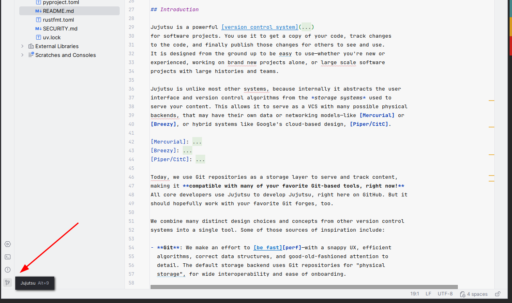
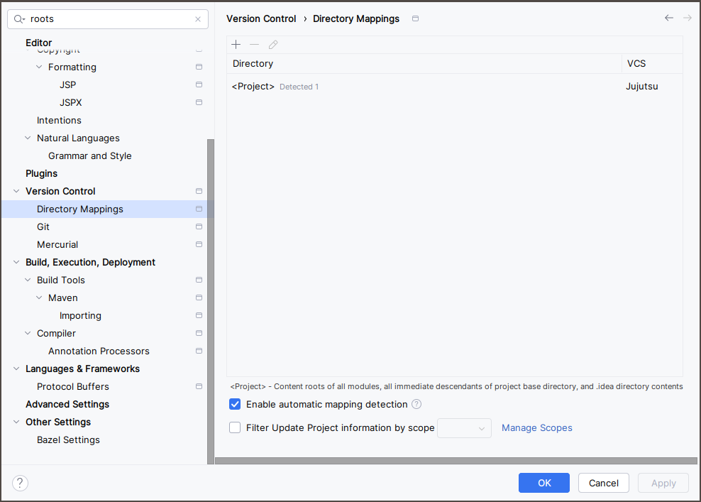
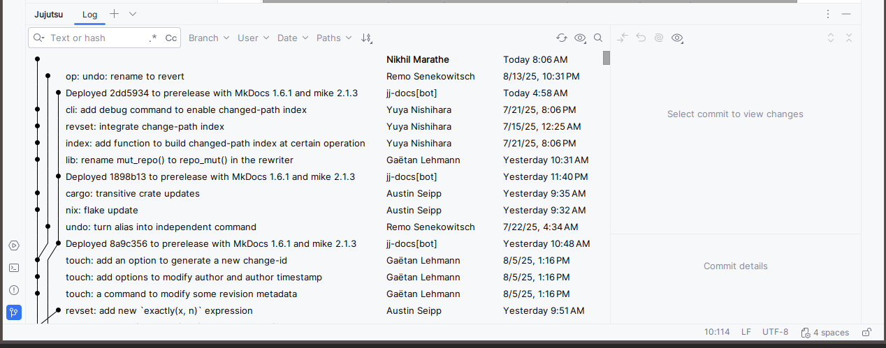
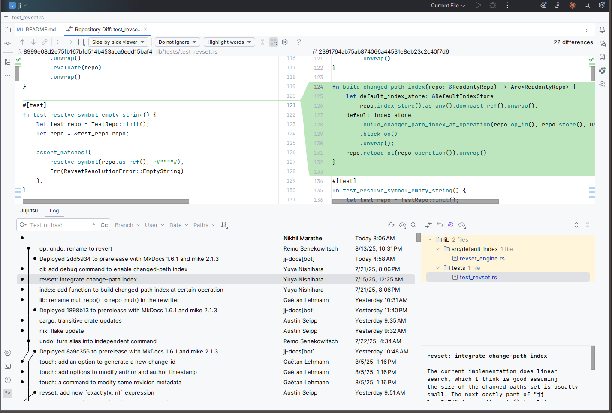
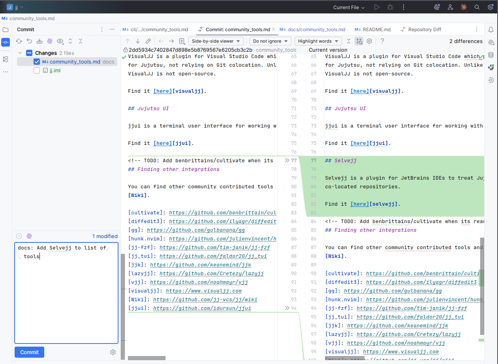

# Usage Guide

This guide uses the term IntelliJ to refer to the IDE. Selvejj works with most JetBrains IDEs, like PyCharm, CLion, and
others. The same instructions will apply to them all.

Screenshots on this page are from IntelliJ IDEA, with the jj repo.

## Supported features

Given the very early stage of the project, only a small set of features are supported.

1. Ability to create new commits at the current parent of the working copy.
2. Ability to view the commit log and diffs from the commit log.
3. View diffs of the current working copy.

## Limitations

* Only single repository projects are supported. If you have a project with multiple subdirectories, each with a jj
  repo, the behavior has not been tested.
* Co-located repositories are not supported.
* The `jj` binary MUST be in your PATH.
* Individual files can be committed/not committed, but hunks are not supported yet.

## Opening a project

Selvejj currently has some limitations. Creating a new project with jj as the VCS is not supported. You must first
create/import the project into IntelliJ.

* `File -> New -> Project from Existing Sources` - use this if you already have a project using jj, and it is not already opened in IntelliJ. You can also use this to clone a Git repository using jj.
* `File -> New -> Project` - use this if you want to create a brand-new project.

Once you have imported the project, IntelliJ should automatically detect the repo and show the VCS as Jujutsu.

## Viewing the commit log

`View -> Tool Window -> Jujutsu` will show the commit log, including diverging heads.

Clicking on a commit will show the details and changed files. Double-clicking on a file will show the diff.

## Creating commits

Selvejj identifies itself as a DVCS and so will use the non-modal Commit tool window by default.

## Refreshing IDE state

Selvejj monitors the `.jj` directory for changes and will refresh the commit log if you make changes via the CLI or other
tools. The commit window may not always update. Use the refresh button to force a refresh.

Note that, similar to the IDE default of treating `.git` and other VCS directories as ignored folders, Selvejj will add
`.jj` to the list of ignored folders.
This is a global IDE setting.